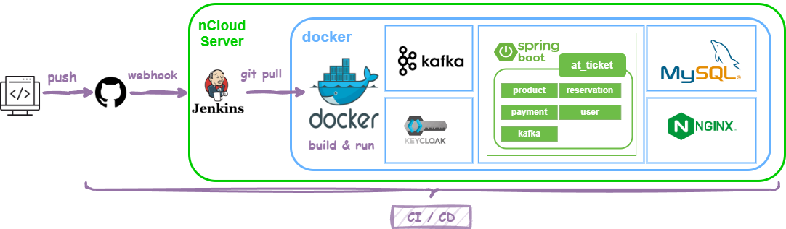

# At Ticket

---

## 🎫 At Ticket － etiquette at ticket

> 콘서트, 뮤지컬, 영화 티켓 상품을 등록하고 예매할 수 있는 티켓 예매 플랫폼 프로젝트입니다.

## 🎫 프로젝트 구조

---

## 🎫사용 기술 및 개발환경

---

  </a> 
  </a>
  </a>
  </a> 
  </a> 
  </a>
  </a> 
  </a> 
  </a> 

## 🎫 기능 목록

---

* **상품**
    * 조회 / 상세 조회
    * 등록 / 수정 / 삭제
    * 관심 등록한 상품의 메일 알림 기능
* **공연**
    * 조회 / 상세조회
    * 등록 / 수정 / 삭제
    * 남은 좌석 조회
    * 공연 티켓 예매
* **회원 기능**
    * 회원 가입 기능
    * 로그인 기능

**Use case** 를 보시려면 👉  [Use Case (wiki)](https://github.com/f-lab-edu/at_ticket/wiki/Use-Case)  
**프로토 타입 화면**을 보시려면 👉  [Use Case (wiki)](https://github.com/f-lab-edu/at_ticket/wiki/proto-type)

## 🎫 협업을 중요시 하였습니다.

---

> 읽기 좋은, 팀원의 의견이 담긴 코드를 작성하기 위해 노력하였습니다.

* **코드 컨벤션**
    * 네이버 code style 적용 [(네이버 코드 컨벤션)](https://naver.github.io/hackday-conventions-java/)
    * 플러그인을 사용하여 코드 컨벤션을 유지 하였습니다.

* **코드 리뷰**
    * Push 된 코드들은 Pull Request를 거쳐,  **코드 리뷰**를 통해 팀원의 의견이 반영된 후 Main branch에 반영됩니다.

## 🎫 멀티모듈 방식을 채택하였습니다.

---

> 코드의 중복을 줄이고 기능들 간의 의존성을 줄이기 위하여 **멀티 모듈 싱글 프로젝트** 방식을 사용하였습니다.

* 공통적으로 사용되는 **Common 모듈**로 분리하여 코드의 중복을 줄였습니다.
* 각 필요한 기능에서 필요한 dependency만 사용할 수 있도록 **plugin을 분리**하여 작성하였습니다.

## 🎫 반복 작업을 자동화 하였습니다.

---
> 반복 작업을 자동화하여 작업 효율을 개선하였습니다.

* **Jenkins**를 사용하여 반복적으로 이루어야 하는 CI/CD 과정을 자동화하였습니다.
* **docker compose**에 세팅을 작성해 놓아 빌드에 매번 걸리는 시간을 줄였습니다.

[//]: # (## 비동기 사용해봄)

## 🎫 프로젝트를 진행하면서 생각해본 고민들

---

> 단순히 기능을 만드는 것에 그치지 않고, 일어날 수 있을 만한 문제점들에 대해 고민해보았습니다.

* 좌석-등급 **매핑 테이블 설계**에 관한 고민
  👉[자세히 보기](https://github.com/f-lab-edu/at_ticket/wiki/Issue--%231)
* **Common 모듈** 사용시 주의할 점 👉[자세히 보기](https://github.com/f-lab-edu/at_ticket/wiki/Issue-%235)
* 예약하기 기능에 관한 고민 👉
    * 사용자가 **동시에 같은 표를 예약**하려고 하는 경우, 누구에게 **표 구매 우선권**을 주어야 하나?
    * 예약하기 프로세스 중간에 **에러가 발생시** / 사용자가 **결제하다 말았을 경우**에는 어떻게해야 할까?

<!--
 * 세션 관리는 어떻게 할 것 인가
 * keyclock, JWT
 * 상태코드는 어떻게 정할 것인가
-->

## 🎫 Done & In progress

---

* **비동기**로 메일 알림 보내기 기능 👉[자세히 보기](https://github.com/f-lab-edu/at_ticket/wiki/Issue--%232)
* **CI/CD 구축** 👉[자세히 보기](https://github.com/f-lab-edu/at_ticket/wiki/Issue--%233)
* **문서화** 작업 (Rest Doc) 👉[자세히 보기](https://github.com/f-lab-edu/at_ticket/wiki/Issue-%234)
* **성능 테스트** 👉
* **테스트 코드** 작성

## 🎫To Do

---

* **대용량 트래픽 처리**를 위한 고민
    * 캐싱
    * Scale out vs Scale up
    * 로드밸런싱

<!-- ^부하테스트로 결과까지 나오면 좋을 듯..-->

<!--말씀해 주신 거,........ -->

=======
