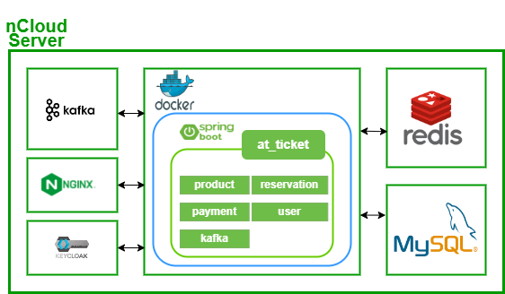
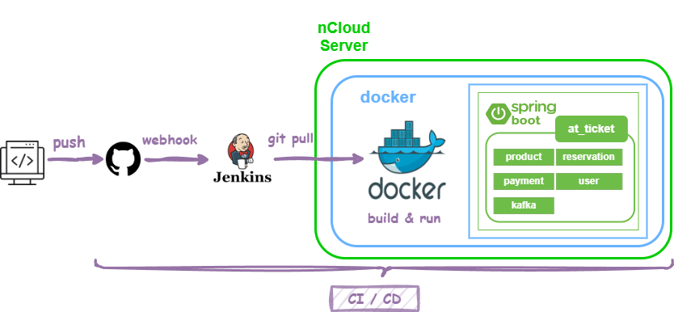

# 🎫 At Ticket


> 콘서트, 뮤지컬, 영화 티켓 상품을 등록하고 예매할 수 있는 티켓 예매 플랫폼 프로젝트입니다.

## 🎫 프로젝트 구조

---



## 🎫사용 기술 및 개발환경

---
<div>
  </a> 
  </a>
  </a>

<br>
  </a>
</a>
</a>
</a>
<br>
</a>
</a>
  <br>
</div>

## 🎫 기능 목록

---

* **상품**
    * 조회 / 상세 조회
    * 등록 / 수정 / 삭제
    * 상품 등록 메일 알림 기능
* **공연**
    * 조회 / 상세조회
    * 등록 / 수정 / 삭제
    * 남은 좌석 조회
    * 공연 티켓 예매
* **회원 기능**
    * 회원 가입 기능
    * 로그인 기능

---

**API 문서**를 보시려면 👉  [API 문서](https://github.com/f-lab-edu/at_ticket/wiki/At_Ticket_API_doc)  
**Use case** 를 보시려면 👉  [Use Case (wiki)](https://github.com/f-lab-edu/at_ticket/wiki/Use-Case)
--- 

## 🎫프로젝트 중점 사항들

---

> 단순히 기능을 만드는 것에 그치지 않고, 여러가지 방면으로 고민해보았습니다.

* **예약하기 기능**에 관한 고민
  👉[자세히 보기](https://github.com/f-lab-edu/at_ticket/wiki/%EC%98%88%EC%95%BD%ED%95%98%EA%B8%B0-%EC%88%98%EC%A0%95)
    * 여러 사용자가 **동시에 같은 표를 예약**하려고 하는 경우, 동시성 문제가 발생하지는 않을지
    * 예약하기 프로세스 중간에 **에러가 발생시** / 사용자가 **결제하다 말았을 경우**에는 어떻게해야 할까?
* kafka를 이용한 **비동기** 메일 발송 기능 👉[자세히 보기](https://github.com/f-lab-edu/at_ticket/wiki/Issue--%232)
* **캐시 서버** 도입을 통한 응답속도 향상 👉[자세히 보기](https://github.com/f-lab-edu/at_ticket/wiki/Issue%E2%80%90redis)
* 좌석-등급 **매핑 테이블 설계**에 관한 고민
  👉[자세히 보기](https://github.com/f-lab-edu/at_ticket/wiki/Issue--%231)
* 확장성과 기능의 독립성을 고려한 **멀티 모듈 설계**

* 코드 품질 관리
    * [네이버 코드 컨벤션](https://naver.github.io/hackday-conventions-java/)을 사용하여 코드 일관성 유지
    * **Pull Request**와 **코드 리뷰**를 사용하여 코드 품질 향상

## 🎫 Dev ops

---

* **CI/CD 구축**  👉[자세히 보기](https://github.com/f-lab-edu/at_ticket/wiki/Issue--%233)



```
1. 개발자가 코드를 깃허브에 푸시.
2. 깃허브가 webhook을 통해, Jenkins로 요청을 보냄.
3. Jenkins가 docker compose를 사용하여 빌드 및 배포
```

* **API 문서 자동화**
    * 문서 자동화 툴인 ``Rest Doc``을 이용하여, 코드와 일치하는 API문서가 생성되도록 자동화 하였습니다.
      👉[자세히 보기](https://github.com/f-lab-edu/at_ticket/wiki/Issue-%234)
* **부하 테스트기**
    * ngrinder를 이용하여 부하를 주어 프로그램의 성능을 측정해보았습니다.
      👉[자세히 보기](https://github.com/f-lab-edu/at_ticket/wiki/%EC%84%B1%EB%8A%A5-%EB%8B%A8%EC%9C%84-%ED%85%8C%EC%8A%A4%ED%8A%B8%EA%B8%B0)

* **Docker compose**를 통한 빌드과정 자동화

## 🎫To Do

---

* **대용량 트래픽 처리**를 위한 고민
    * **Scale out** vs **Scale up**
    * 로드밸런싱


